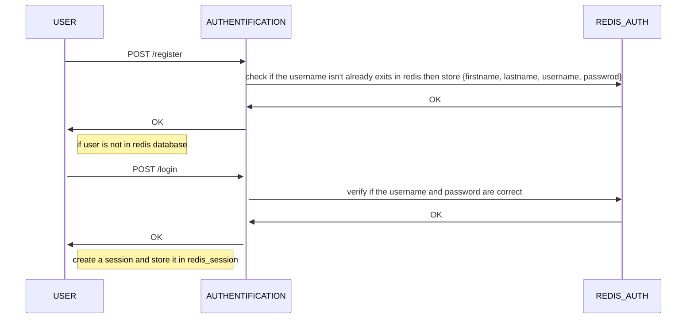
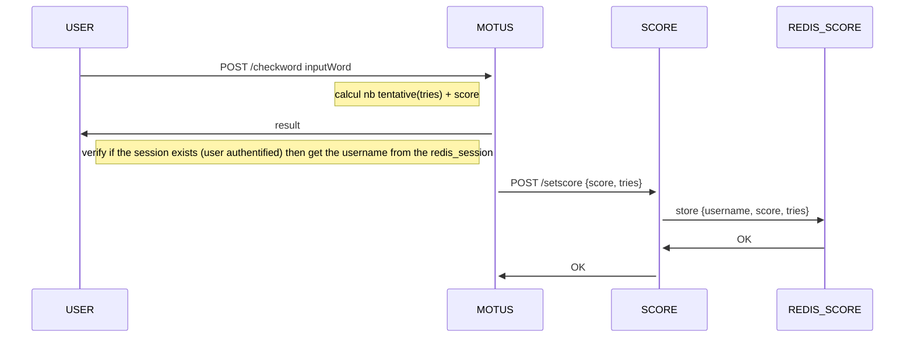
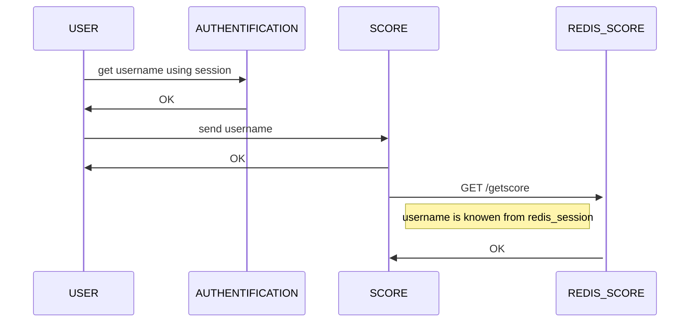

# Remarque :
En ce qui concerne ce projet, je suis tout seul à faire tout le travail, et malgré ça j'avais réussi à coder les 3 mircorservices (auth, score, motus). La dérnière séance avant que je commençais le service authentification, le
score et motus fonctionnaient bien (le mot saisie s'affiche en bas avec les lettre coloriés selon les règles de jeu, mais dans l'étape d'auth, j'ai rajouter 2 redis containers : un pour l'enregistrement des sessions de login, et l'autre
pour la base de données de scores. Et avec le container redis_score pour la base de données des scores ça devien 3 containers de l'image redis mais chacun mappé sur un différent port, ce qui est évident dans le ficher 
**docke-compose.yaml**. Mais malgré ça, quant je lance le docker compose aucun redis ne fonctionne bien ce qui a rendu l'authentification et la gestion des session users aussi érronées.
Malheuresement, c'est le dérnier jour et j'ai tenté toute la journée d'avoir quelque chose qui fonctionne mais sans résultat. J'éspère que vous allez prendre en compte que je fais le pojet inidivuduelement.
Mais à part les erreurs du code, le concept des microservices attendu de ce projet est bien compris, ce qui sera expliqué dans ce qui vienne : 
# Phase d'authentification (port 9000)

# Phase de jeu (port 3000)

Dans cette application, on a configuré le haproxy, pour que l'application tourne sur 2 ports pour que l'un remplace l'autre dans le cas ce dérniè est tombé. Ceci fait au niveau de répertoire **motus/haproxy**.

# Phase de visualisation du score (port 5000)

## Démarrage du projet

Pour lancer ce projet, assurez-vous d'abord que vous avez Docker et Docker Compose installés sur votre système. Ensuite, suivez les étapes ci-dessous :

1. Clonez le dépôt GitHub :

```bash
git https://github.com/essadany/motus.git
cd motus
docker-compose -f "docker-compose.yaml" up -d --build 


