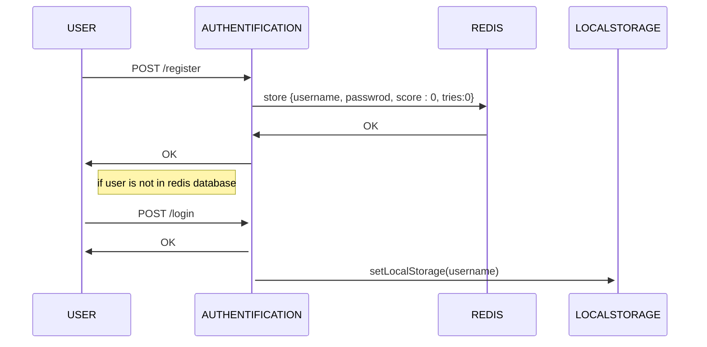
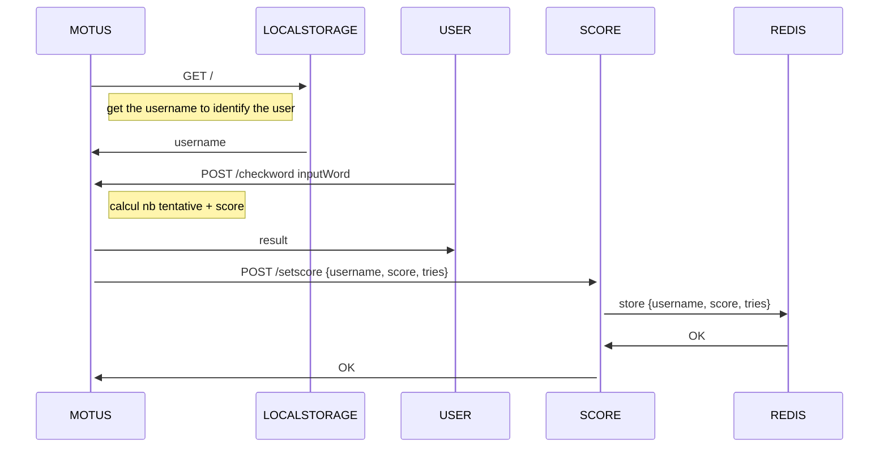
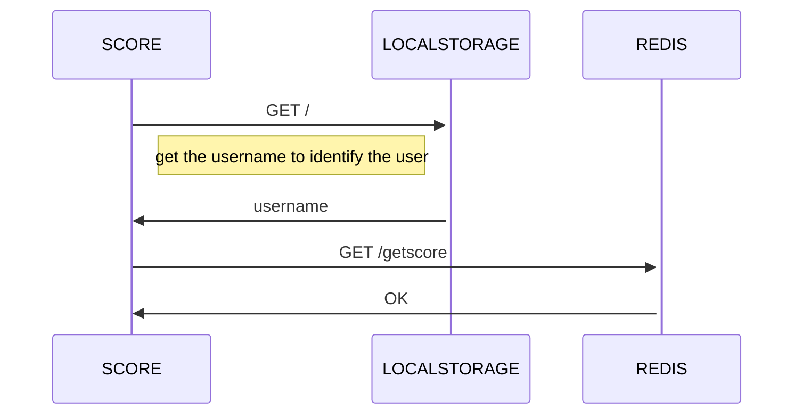

#Phase d'authentification

#Phase de jeux

#Phase de visualisation du score

flowchart LR
    user-->motus
    motus-->|getscore|score
    motus-->|setscore|score
    score-->redis
    
flowchart LR
    user-->motus
    motus-->|addscore user,  mot, +1 : isWordFound|score
    score-->redis
    
