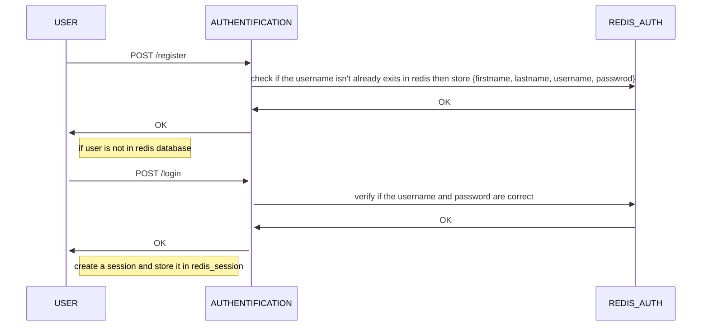
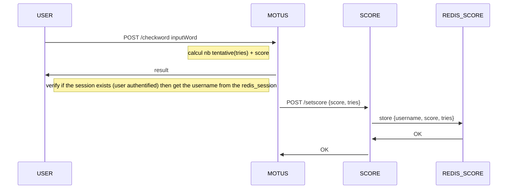
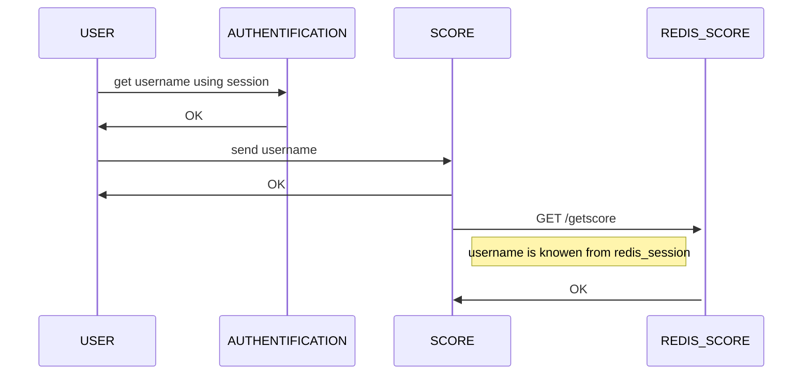

# Phase d'authentification

```mermaid
sequenceDiagram
    USER->>AUTHENTIFICATION:POST /register
    AUTHENTIFICATION->>REDIS_AUTH: check if the username isn't already exits in redis then store {firstname, lastname, username, passwrod}
    REDIS_AUTH->>AUTHENTIFICATION:OK
    AUTHENTIFICATION->>+USER:OK
    note right of USER : if user is not in redis database
    USER->>+AUTHENTIFICATION: POST /login
    AUTHENTIFICATION->>REDIS_AUTH: verify if the username and password are correct
    REDIS_AUTH->>AUTHENTIFICATION: OK
    AUTHENTIFICATION->>USER:OK
    note left of AUTHENTIFICATION: create a session and store it in redis_session
```
# Phase de jeu

```mermaid
sequenceDiagram
    USER->>+MOTUS:POST /checkword  inputWord
    note left of MOTUS : calcul nb tentative(tries) + score
    MOTUS->>USER : result
    note left of MOTUS: verify if the session exists (user authentified) then get the username from the redis_session
    MOTUS->>+SCORE : POST /setscore {score, tries}
    SCORE->>REDIS_SCORE : store {username, score, tries}
    REDIS_SCORE->>SCORE : OK
    SCORE->>MOTUS : OK
```
# Phase de visualisation du score

```mermaid
sequenceDiagram
    USER->>AUTHENTIFICATION : get username using session
    AUTHENTIFICATION->>USER : OK
    USER->>SCORE : send username
    SCORE->>USER : OK
    SCORE->>+REDIS_SCORE : GET /getscore
    note left of REDIS_SCORE : username is knowen from redis_session
    REDIS_SCORE->>SCORE : OK
```

